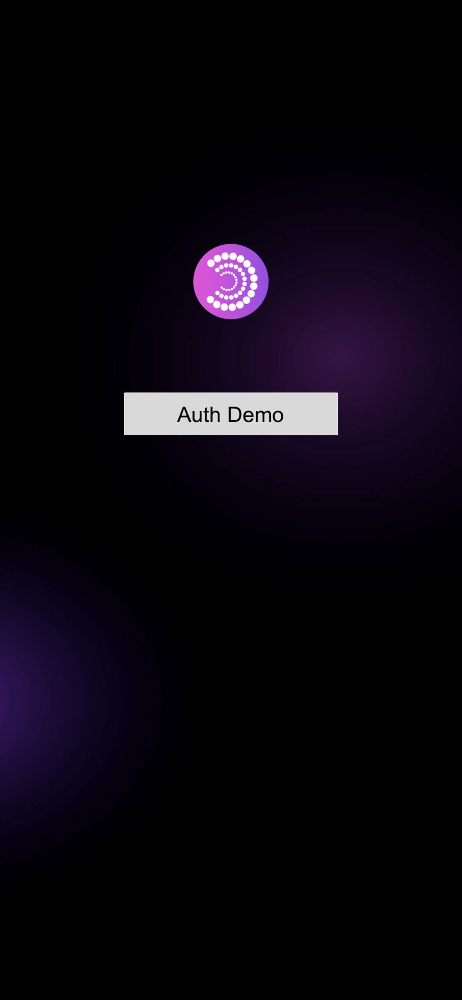

 

## **Prerequisites**

Install Cocos Creator 3.7.2 or later. Earlier versions may also be compatible but will not be actively supported. Install Cocos Creator 3.7.2 or later. Earlier versions may also be compatible but will not be actively supported. 

**iOS and Android**

*(iOS only)* Install the following:

- Xcode 14.1 or higher
- CocoaPods 1.10.0 or higher

Make sure that your Unity project meets these requirements:

- **For iOS** — targets iOS 13 or higher
- **For Android** — Minimum API Level 23 or higher,Targets API level 31 or higher，Pack apk must be with exporting project to Android Studio, [change Java SDK version to 11](https://stackoverflow.com/questions/66449161/how-to-upgrade-an-android-project-to-java-11)

## 📗 Docs

**Auth**: https://docs.particle.network/developers/auth-service/sdks/cocos

## 💼 Feedback

If you got some problems, please report bugs or issues.

You can also join our [Discord](https://discord.gg/2y44qr6CR2).